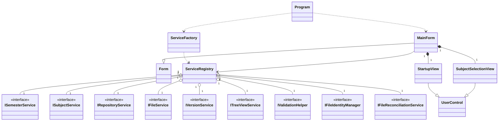
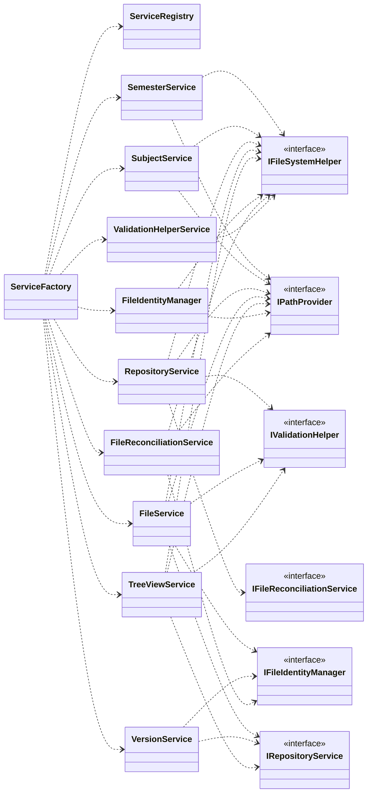
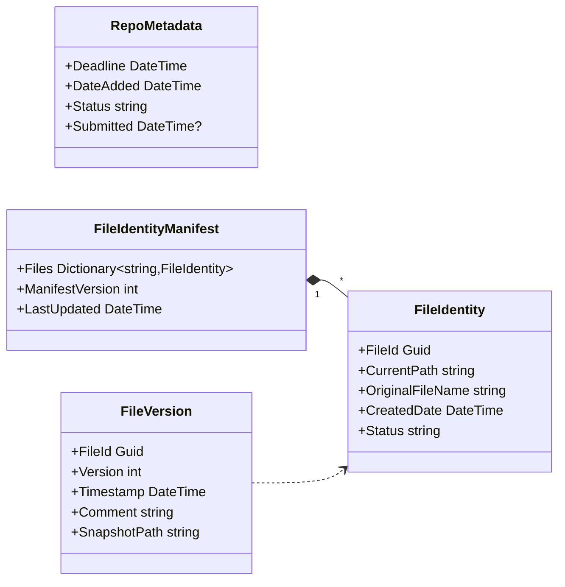

# IskolRepo

**IskolRepo** is a local Windows desktop application that helps students organize academic files and tasks by semester, subject, and activity repository. It works like a smarter version of the folders already on your PC: students can create semester folders, group coursework by subject, initialize repositories for individual tasks, track deadlines and submission statuses, create files, organize subrepositories, and save snapshots of supported work so previous versions can be restored when needed.

The application is built with **C#**, **.NET 10**, and **Windows Forms**. It is designed to work offline and store all academic data locally on the user's computer.

## Developers

- Donatos, Trixter Lanz C.
- Ilao, Kent Patrick M.
- Laganzon, Adrian G.
- Villanueva, Franz Daniel

## Project Description and Purpose

Students often keep school files in ordinary folders such as `1st Semester`, `Programming`, `Assignment 1`, or `Final Project`. This works at first, but it becomes harder to manage as deadlines, revisions, file versions, and multiple subjects pile up.

IskolRepo solves this problem by giving students a desktop workspace that follows the way academic work is naturally organized:

```text
Semester -> Subject -> Repository/Activity -> Files and Subrepositories
```

Each repository represents an academic task or activity, such as an assignment, laboratory exercise, report, presentation, or project requirement. The system keeps repository metadata, including deadline, date added, status, and submitted date. It also includes a local version history feature for supported file types, allowing students to save snapshots of their work and revert to earlier versions.

The purpose of IskolRepo is to provide a simple, offline, student-centered file management system that reduces clutter, improves coursework tracking, and protects students from losing important previous versions of their work.

## UML Diagrams

The project is documented through focused UML diagrams instead of one large diagram. Each diagram highlights one architectural concern: application structure, service implementations, dependency injection, and persisted domain data.

### High-Level Architecture Diagram

This diagram shows how the desktop UI is composed and how the main form reaches the application's service layer through `ServiceRegistry`.



### Service Implementation Diagram

This diagram maps each interface to its concrete implementation. It intentionally avoids constructor dependencies so the implementation layer stays easy to scan.

```mermaid
classDiagram
  direction TB

  class ISemesterService {
    <<interface>>
  }
  class ISubjectService {
    <<interface>>
  }
  class IRepositoryService {
    <<interface>>
  }
  class IFileService {
    <<interface>>
  }
  class IVersionService {
    <<interface>>
  }
  class ITreeViewService {
    <<interface>>
  }
  class IFileIdentityManager {
    <<interface>>
  }
  class IFileReconciliationService {
    <<interface>>
  }
  class IValidationHelper {
    <<interface>>
  }
  class IFileSystemHelper {
    <<interface>>
  }
  class IPathProvider {
    <<interface>>
  }

  class SemesterService
  class SubjectService
  class RepositoryService
  class FileService
  class VersionService
  class TreeViewService
  class FileIdentityManager
  class FileReconciliationService
  class ValidationHelperService
  class FileSystemService
  class PathProviderService

  SemesterService ..|> ISemesterService
  SubjectService ..|> ISubjectService
  RepositoryService ..|> IRepositoryService
  FileService ..|> IFileService
  VersionService ..|> IVersionService
  TreeViewService ..|> ITreeViewService
  FileIdentityManager ..|> IFileIdentityManager
  FileReconciliationService ..|> IFileReconciliationService
  ValidationHelperService ..|> IValidationHelper
  FileSystemService ..|> IFileSystemHelper
  PathProviderService ..|> IPathProvider
```



### Dependency Injection Diagram

This diagram shows the constructor-injected dependencies between services. Infrastructure abstractions sit on the right because most services depend on file-system and path operations.



### Domain Model Diagram

This diagram focuses on the persisted data used by repositories and version history.



## Features and Functionalities

### Semester Management

- Create a new semester folder in a selected location.
- Open an existing IskolRepo semester folder.
- Use a hidden `.semester.json` marker file to verify valid semester folders.
- Return to the startup screen and switch to another semester.

### Subject Management

- Add subjects inside the active semester.
- Display subjects as selectable cards.
- Open a subject workspace to view and manage repositories.

### Repository and Activity Management

- Create repositories for individual academic tasks or activities.
- Assign a deadline when creating a repository.
- Store repository metadata in a hidden `.metadata/metadata.json` file.
- Update repository status using the supported statuses:
  - `in-progress`
  - `completed`
  - `submitted`
- Automatically record the submitted date when a repository is marked as submitted.
- Display deadline status, such as due today, days before due date, past due date, submitted, or submitted late.
- Show warning indicators for repositories that are due, overdue, or submitted late.

### File and Folder Organization

- Create supported academic file types inside a repository:
  - Text File (`.txt`)
  - Word Document (`.docx`)
  - PowerPoint Presentation (`.pptx`)
  - Excel Spreadsheet (`.xlsx`)
  - Publisher Document (`.pub`)
  - OneNote Notebook (`.one`)
  - Access Database (`.accdb`)
- Create subrepositories or nested folders inside a repository.
- Browse repository contents through a tree view and list view.
- Double-click files to open them with their default Windows application.
- Prevent invalid workflow usage by warning when files are placed directly under a subject instead of inside a repository.

### Local Version History

- Save version snapshots for supported versioned files:
  - `.txt`
  - `.docx`
- Add a comment every time a version is saved.
- View version history with version number, timestamp, and comment.
- Revert a file to a selected previous version.
- Remove newer versions when reverting, keeping the version timeline consistent.
- Track files using GUID-based identities so version history can remain connected to a file even when file handling changes.

### File Identity and Reconciliation

- Maintain a hidden file manifest at `.metadata/files.json`.
- Assign each tracked file a unique `Guid`.
- Store each file's current path, original file name, creation date, and identity status.
- Detect lost or orphaned files in the manifest.
- Reconcile files by comparing content hashes with existing version snapshots.
- Migrate older filename-based history folders into GUID-based history folders.

### User Interface

- Windows Forms desktop interface.
- Startup screen for opening or creating a semester.
- Subject selection screen with animated subject cards.
- Main workspace with repository tree, file list, metadata panel, and version history panel.
- Dark and light theme support through the theme toggle button.
- Icons for files, folders, repositories, and validation warnings.

## How the Program Works

When the application starts, `Program.cs` initializes Windows Forms, registers global error handlers, creates the application services through `ServiceFactory.CreateServices()`, and opens `MainForm`.

The main workflow is:

1. The user creates or opens a semester.
2. The semester is validated using the hidden `.semester.json` marker.
3. The user creates or selects a subject.
4. Inside a subject, the user creates repositories for specific tasks or activities.
5. Each repository receives hidden metadata containing the deadline, date added, status, and submitted date.
6. The user creates files and subrepositories inside the selected repository.
7. The tree view and file list display the current repository structure while hiding system-managed metadata files.
8. If the user selects a supported file, the version panel displays its saved snapshots.
9. The user may save a new version with a comment or revert to an earlier version.

The application's local folder structure looks like this:

```text
Selected Parent Folder/
└── Semester Name/
    ├── .semester.json
    └── Subject Name/
        └── Repository or Activity Name/
            ├── .metadata/
            │   ├── metadata.json
            │   ├── files.json
            │   └── .history/
            │       └── {file-guid}/
            │           ├── v1.docx
            │           ├── v2.docx
            │           └── log.json
            ├── Research.docx
            ├── Notes.txt
            └── Subrepository/
                └── Draft.txt
```

The system is fully local. It does not require an internet connection to manage files, create repositories, save snapshots, or open existing coursework.

## Project Structure

```text
IskolRepository/
├── Core/
│   ├── Interfaces/
│   │   ├── Infrastructure/
│   │   ├── IFileService.cs
│   │   ├── IRepositoryService.cs
│   │   ├── ISemesterService.cs
│   │   ├── ISubjectService.cs
│   │   ├── ITreeViewService.cs
│   │   └── IVersionService.cs
│   ├── Services/
│   │   ├── Infrastructure/
│   │   ├── FileIdentityManager.cs
│   │   ├── FileReconciliationService.cs
│   │   ├── FileService.cs
│   │   ├── RepositoryService.cs
│   │   ├── SemesterService.cs
│   │   ├── SubjectService.cs
│   │   ├── TreeViewService.cs
│   │   └── VersionService.cs
│   ├── IconProvider.cs
│   ├── ServiceCollectionExtensions.cs
│   ├── TreeNodeData.cs
│   └── VersionHelper.cs
├── Forms/
│   ├── MainForm.cs
│   ├── StartupView.cs
│   ├── SubjectSelectionView.cs
│   ├── RepoCreationDialog.cs
│   ├── FileTypeDialog.cs
│   └── PromptDialog.cs
├── Models/
│   ├── FileIdentity.cs
│   ├── FileIdentityManifest.cs
│   ├── FileVersion.cs
│   ├── RepoCreationInfo.cs
│   └── RepoMetadata.cs
├── Utilities/
│   ├── AnimationHelper.cs
│   ├── DateOnlyDateTimeConverter.cs
│   └── ThemeManager.cs
├── Program.cs
├── IskolRepository.csproj
├── IskolRepository.sln
└── README.md
```

## Instructions on How to Run the Application

### Prerequisites

- Windows operating system
- .NET SDK `10.0.203` or compatible .NET 10 SDK
- Visual Studio 2022 or later is recommended for opening and editing the WinForms project

### Run Using Visual Studio

1. Clone or download the repository.
2. Open `IskolRepository.sln` in Visual Studio.
3. Restore NuGet packages if Visual Studio does not do it automatically.
4. Set `IskolRepository` as the startup project.
5. Click **Start** or press `F5`.

### Run Using the Command Line

From the repository root, run:

```bash
dotnet restore
dotnet build IskolRepository.sln
dotnet run --project IskolRepository.csproj
```

### Build Output

After building, the executable can be found in a folder similar to:

```text
bin/Debug/net10.0-windows/IskolRepository.exe
```

The exact folder may differ depending on whether the project is built in Debug or Release mode.

## Repository Access Note

This project is intended to be submitted through a GitHub repository. The instructor must have access to the repository. The repository may be public, or if it is private, the instructor should be added as a collaborator.
