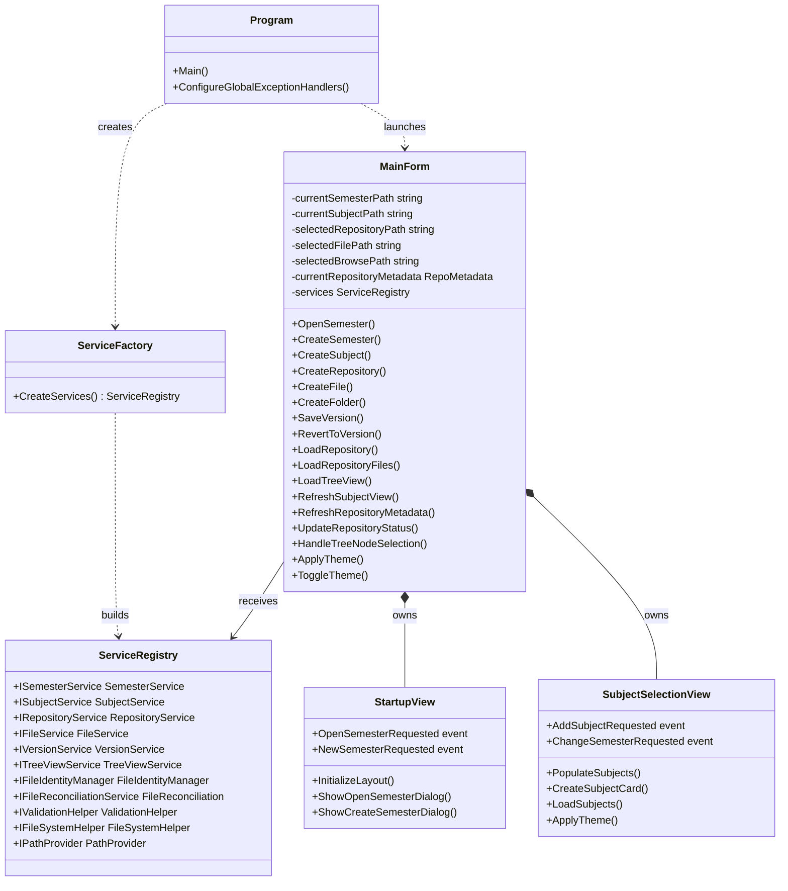
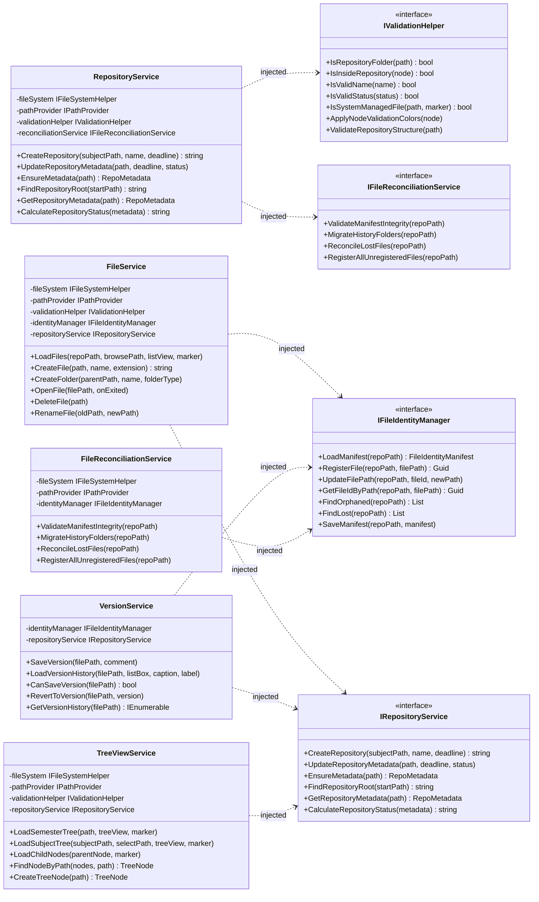
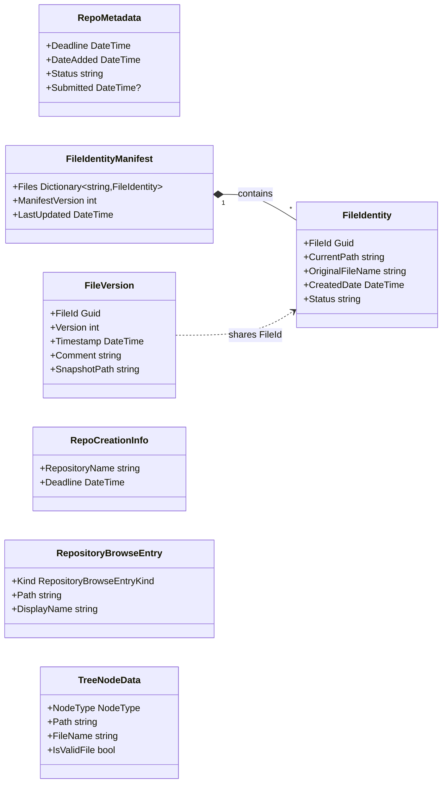

# 📚 IskolRepo

> A local Windows desktop application for organizing academic files, repositories, coursework, and version history.

---

# 📖 Project Description and Purpose

## Overview

**IskolRepo** is a local Windows desktop application that helps students organize academic files and tasks by:

- Semester
- Subject
- Repository or Activity

The system works like a smarter version of ordinary folders on a computer. Students can create semester folders, organize coursework by subject, initialize repositories for activities, manage deadlines, track submission status, create files, organize subrepositories, and maintain local version history for supported files.

The application is built using:

- **C#**
- **.NET 10**
- **Windows Forms**

and is designed to work completely **offline**, storing all academic data locally on the user's computer.

---

## Purpose of the System

Students commonly organize files using folders such as:

```text
1st Semester/
Programming/
Assignment 1/
Final Project/
```

Although this works initially, managing deadlines, revisions, versions, and multiple subjects becomes difficult as coursework increases.

IskolRepo solves this problem by introducing a structured academic repository system:

```text
Semester → Subject → Repository/Activity → Files and Subrepositories
```

Each repository represents a specific academic activity such as:

- Assignments
- Laboratory Exercises
- Reports
- Presentations
- Projects

The system stores repository metadata including:

- Deadline
- Date Added
- Status
- Submitted Date

It also provides a **local version history feature** for supported file types, allowing students to save snapshots of their work and restore previous versions when necessary.

---

# 🧩 UML Diagram

The UML documentation is divided into focused diagrams so each one explains a specific architectural concern while preserving the original class and relationship details.

---

## 🏗️ High-Level Architecture Diagram

This diagram shows the application entry point, UI ownership, and service access path used by `MainForm`.



---

## ⚙️ Service Implementation Diagram

This diagram shows the service interfaces, concrete implementations, and interface realization relationships.

```mermaid
classDiagram
  direction TB

  class ISemesterService {
    <<interface>>
    +OpenSemester(path) string
    +CreateSemester(parentPath, name) string
    +CreateSemesterMarker(path)
    +IsValidSemester(path) bool
  }

  class ISubjectService {
    <<interface>>
    +CreateSubject(semesterPath, name)
    +GetSubjectsForSemester(path) IEnumerable
    +LoadSubjectsUI(path, panel, factory, onEmpty)
  }

  class IRepositoryService {
    <<interface>>
    +CreateRepository(subjectPath, name, deadline) string
    +UpdateRepositoryMetadata(path, deadline, status)
    +EnsureMetadata(path) RepoMetadata
    +FindRepositoryRoot(startPath) string
    +GetRepositoryMetadata(path) RepoMetadata
    +CalculateRepositoryStatus(metadata) string
  }

  class IFileService {
    <<interface>>
    +LoadFiles(repoPath, browsePath, listView, marker)
    +CreateFile(path, name, extension) string
    +CreateFolder(parentPath, name, folderType)
    +OpenFile(filePath, onExited)
    +DeleteFile(path)
    +RenameFile(oldPath, newPath)
  }

  class IVersionService {
    <<interface>>
    +SaveVersion(filePath, comment)
    +LoadVersionHistory(filePath, listBox, caption, label)
    +CanSaveVersion(filePath) bool
    +RevertToVersion(filePath, version)
    +GetVersionHistory(filePath) IEnumerable
  }

  class ITreeViewService {
    <<interface>>
    +LoadSemesterTree(path, treeView, marker)
    +LoadSubjectTree(subjectPath, selectPath, treeView, marker)
    +LoadChildNodes(parentNode, marker)
    +FindNodeByPath(nodes, path) TreeNode
    +CreateTreeNode(path) TreeNode
  }

  class IFileIdentityManager {
    <<interface>>
    +LoadManifest(repoPath) FileIdentityManifest
    +RegisterFile(repoPath, filePath) Guid
    +UpdateFilePath(repoPath, fileId, newPath)
    +GetFileIdByPath(repoPath, filePath) Guid
    +FindOrphaned(repoPath) List
    +FindLost(repoPath) List
    +SaveManifest(repoPath, manifest)
  }

  class IFileReconciliationService {
    <<interface>>
    +ValidateManifestIntegrity(repoPath)
    +MigrateHistoryFolders(repoPath)
    +ReconcileLostFiles(repoPath)
    +RegisterAllUnregisteredFiles(repoPath)
  }

  class IValidationHelper {
    <<interface>>
    +IsRepositoryFolder(path) bool
    +IsInsideRepository(node) bool
    +IsValidName(name) bool
    +IsValidStatus(status) bool
    +IsSystemManagedFile(path, marker) bool
    +ApplyNodeValidationColors(node)
    +ValidateRepositoryStructure(path)
  }

  class IFileSystemHelper {
    <<interface>>
    +FileExists(path) bool
    +DirectoryExists(path) bool
    +CreateDirectory(path)
    +DeleteFile(path)
    +DeleteDirectory(path)
    +ReadAllText(path) string
    +WriteAllText(path, text)
    +EnumerateFiles(path) IEnumerable
    +EnumerateDirectories(path) IEnumerable
    +CopyFile(source, destination)
    +MoveFile(source, destination)
  }

  class IPathProvider {
    <<interface>>
    +CombinePaths(paths) string
    +GetFileName(path) string
    +GetDirectoryName(path) string
    +GetExtension(path) string
    +GetFullPath(path) string
    +GetRelativePath(basePath, path) string
  }

  class SemesterService {
    -fileSystem IFileSystemHelper
    -pathProvider IPathProvider

    +OpenSemester(path) string
    +CreateSemester(parentPath, name) string
    +CreateSemesterMarker(path)
    +IsValidSemester(path) bool
  }

  class SubjectService {
    -fileSystem IFileSystemHelper
    -pathProvider IPathProvider

    +CreateSubject(semesterPath, name)
    +GetSubjectsForSemester(path) IEnumerable
    +LoadSubjectsUI(path, panel, factory, onEmpty)
  }

  class RepositoryService {
    -fileSystem IFileSystemHelper
    -pathProvider IPathProvider
    -validationHelper IValidationHelper
    -reconciliationService IFileReconciliationService

    +CreateRepository(subjectPath, name, deadline) string
    +UpdateRepositoryMetadata(path, deadline, status)
    +EnsureMetadata(path) RepoMetadata
    +FindRepositoryRoot(startPath) string
    +GetRepositoryMetadata(path) RepoMetadata
    +CalculateRepositoryStatus(metadata) string
  }

  class FileService {
    -fileSystem IFileSystemHelper
    -pathProvider IPathProvider
    -validationHelper IValidationHelper
    -identityManager IFileIdentityManager
    -repositoryService IRepositoryService

    +LoadFiles(repoPath, browsePath, listView, marker)
    +CreateFile(path, name, extension) string
    +CreateFolder(parentPath, name, folderType)
    +OpenFile(filePath, onExited)
    +DeleteFile(path)
    +RenameFile(oldPath, newPath)
  }

  class VersionService {
    -identityManager IFileIdentityManager
    -repositoryService IRepositoryService

    +SaveVersion(filePath, comment)
    +LoadVersionHistory(filePath, listBox, caption, label)
    +CanSaveVersion(filePath) bool
    +RevertToVersion(filePath, version)
    +GetVersionHistory(filePath) IEnumerable
  }

  class TreeViewService {
    -fileSystem IFileSystemHelper
    -pathProvider IPathProvider
    -validationHelper IValidationHelper
    -repositoryService IRepositoryService

    +LoadSemesterTree(path, treeView, marker)
    +LoadSubjectTree(subjectPath, selectPath, treeView, marker)
    +LoadChildNodes(parentNode, marker)
    +FindNodeByPath(nodes, path) TreeNode
    +CreateTreeNode(path) TreeNode
  }

  class FileIdentityManager {
    -fileSystem IFileSystemHelper
    -pathProvider IPathProvider

    +LoadManifest(repoPath) FileIdentityManifest
    +RegisterFile(repoPath, filePath) Guid
    +UpdateFilePath(repoPath, fileId, newPath)
    +GetFileIdByPath(repoPath, filePath) Guid
    +FindOrphaned(repoPath) List
    +FindLost(repoPath) List
    +SaveManifest(repoPath, manifest)
  }

  class FileReconciliationService {
    -fileSystem IFileSystemHelper
    -pathProvider IPathProvider
    -identityManager IFileIdentityManager

    +ValidateManifestIntegrity(repoPath)
    +MigrateHistoryFolders(repoPath)
    +ReconcileLostFiles(repoPath)
    +RegisterAllUnregisteredFiles(repoPath)
  }

  class ValidationHelperService {
    -fileSystem IFileSystemHelper

    +IsRepositoryFolder(path) bool
    +IsInsideRepository(node) bool
    +IsValidName(name) bool
    +IsValidStatus(status) bool
    +IsSystemManagedFile(path, marker) bool
    +ApplyNodeValidationColors(node)
    +ValidateRepositoryStructure(path)
  }

  SemesterService ..|> ISemesterService
  SubjectService ..|> ISubjectService
  RepositoryService ..|> IRepositoryService
  FileService ..|> IFileService
  VersionService ..|> IVersionService
  TreeViewService ..|> ITreeViewService
  FileIdentityManager ..|> IFileIdentityManager
  FileReconciliationService ..|> IFileReconciliationService
  ValidationHelperService ..|> IValidationHelper
```



---

## 🔌 Dependency Injection Diagram

This diagram preserves the constructor dependency relationships from the original design.



---

## 🗂️ Domain Model Diagram

This diagram isolates persisted repository, identity, and versioning data.



---

# ✨ Features and Functionalities of the System

## 📁 Semester Management

- Create a new semester folder
- Open existing semester folders
- Validate semester folders using `.semester.json`
- Switch between semesters

---

## 📚 Subject Management

- Add subjects inside semesters
- Display subjects as selectable cards
- Open subject workspaces

---

## 🗃️ Repository and Activity Management

- Create repositories for academic activities
- Assign deadlines
- Store metadata using hidden files
- Track repository status:
  - `in-progress`
  - `completed`
  - `submitted`
- Automatically record submitted dates
- Show due date warnings and overdue indicators

---

## 📄 File and Folder Organization

Supported file creation:

- `.txt`
- `.docx`
- `.pptx`
- `.xlsx`
- `.pub`
- `.one`
- `.accdb`

Additional features:

- Create nested folders
- Browse through tree view and list view
- Open files using default Windows applications
- Prevent invalid workflow usage

---

## 🕓 Local Version History

Supported version-controlled files:

- `.txt`
- `.docx`

Features include:

- Save snapshots with comments
- View version history
- Restore previous versions
- Maintain version timelines
- Track files using GUID identities

---

## 🔍 File Identity and Reconciliation

- Maintain hidden `.metadata/files.json`
- Assign unique `Guid` identifiers
- Detect orphaned and lost files
- Reconcile histories using content hashes
- Migrate older filename-based histories

---

## 🎨 User Interface

- Windows Forms desktop interface
- Startup screen
- Subject selection view with animations
- Repository tree view and file explorer
- Metadata and version history panels
- Dark and light mode support
- Icons and warning indicators

---

# ⚙️ Explanation of How the Program Works

When the application starts:

1. `Program.cs` initializes Windows Forms.
2. Global exception handlers are registered.
3. Services are created through `ServiceFactory.CreateServices()`.
4. `MainForm` is launched.

---

## 🔄 Main Workflow

### 1. Semester Creation or Opening

The user creates or opens a semester folder.

The system validates the semester using:

```text
.semester.json
```

---

### 2. Subject Selection

The user creates or selects a subject.

---

### 3. Repository Creation

Repositories are created for academic activities such as:

- Assignments
- Projects
- Research
- Reports
- Laboratory Exercises

Each repository stores hidden metadata including:

- Deadline
- Date Added
- Status
- Submitted Date

---

### 4. File Management

Users can:

- Create files
- Create subrepositories
- Organize folders
- Browse repository contents

System-managed metadata files remain hidden.

---

### 5. Version History

When a supported file is selected:

- The version panel displays saved snapshots
- Users may save new versions with comments
- Users may restore earlier versions

---

## 🗂️ Local Folder Structure

```text
Selected Parent Folder/
└── Semester Name/
    ├── .semester.json
    └── Subject Name/
        └── Repository or Activity Name/
            ├── .metadata/
            │   ├── metadata.json
            │   ├── files.json
            │   └── .history/
            │       └── {file-guid}/
            │           ├── v1.docx
            │           ├── v2.docx
            │           └── log.json
            ├── Research.docx
            ├── Notes.txt
            └── Subrepository/
                └── Draft.txt
```

The system works completely offline and does not require an internet connection.

---

# ▶️ Instructions on How to Run the Application

## ✅ Prerequisites

Required software:

- Windows Operating System
- .NET SDK `10.0.203` or compatible .NET 10 SDK
- Visual Studio 2022 or later

---

## 🖥️ Run Using Visual Studio

1. Clone or download the repository
2. Open:

```text
IskolRepository.sln
```

3. Restore NuGet packages if necessary
4. Set `IskolRepository` as the startup project
5. Press `F5` or click **Start**

---

## 💻 Run Using the Command Line

From the repository root, run:

```bash
dotnet restore
dotnet build IskolRepository.sln
dotnet run --project IskolRepository.csproj
```

---

## 📦 Build Output

After building, the executable is typically located at:

```text
bin/Debug/net10.0-windows/IskolRepository.exe
```

The exact folder may vary depending on the build configuration.

---

# 👨‍💻 Names of the Developers or Team Members

- **Donatos, Trixter Lanz C.**
- **Ilao, Kent Patrick M.**
- **Laganzon, Adrian G.**
- **Villanueva, Franz Daniel**